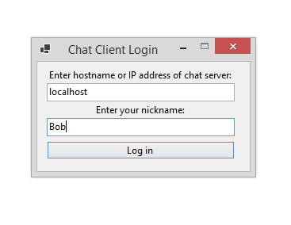
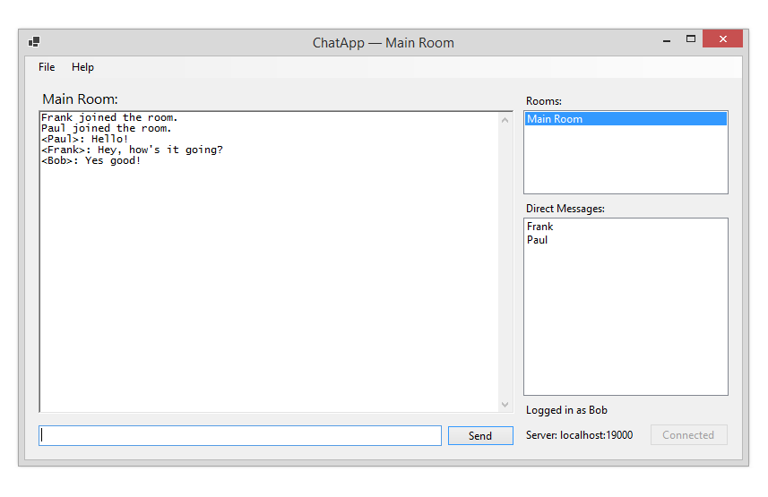
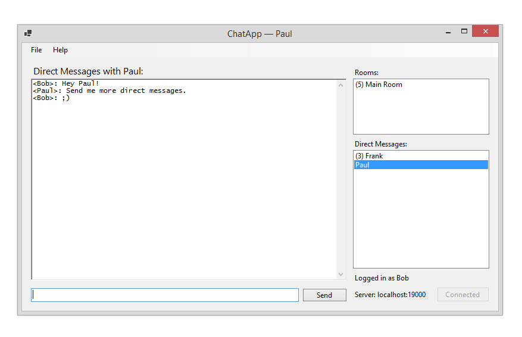

# ChatApp

Chat application written in C#/.NET using WinForms.

# Features
* Chat rooms--users can create their own rooms to chat in to message multiple users simultaneously.
* Direct messaging between users connected to the server.
* End-to-end encrypted chat rooms.  Users can set their room to have a known password from which a symmetric private key is derived and used for encryption between partipants.  The encryption is performed purely by the clients; thus the server (and any unwanted parties listening on the network) can never see the plain text messages.
* SSL/TLS encrypted socket connection.
* Trust-on-first-use (TOFU) certificate validation scheme.

Note that the code is a bit messy at the moment and still needs to be refactored.
